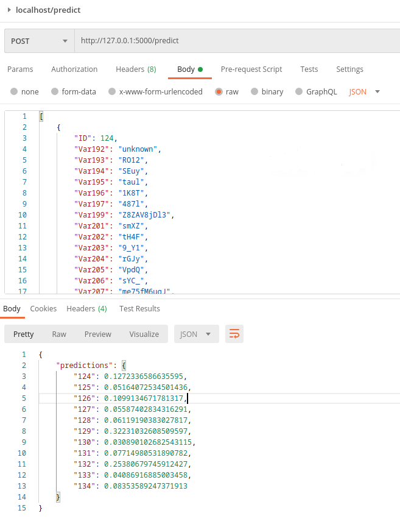

# Прогнозирование оттока клиентов телеком-оператора

## Используемый стэк технологий

* Язык программирования и среды разработки:
    - Python >= 3.6
    - Jupyter
    - PyCharm
* Инструменты создания и тестирования веб-интерфейса:
    - Flask
    - Postman
* Библиотеки для вычислений, обработки и статистического анализа данных: 
    - numpy
    - scipy
    - statsmodels
    - pandas
    - category-encoders
    - feature-engine
* Фреймворки и библиотеки для машинного обучения: 
    - scikit-learn
    - xgboost
    - lightgbm
    - catboost
* Библиотеки для создания визуализаций:
    - matplotlib
    - seaborn
    - missingno
    - scikit-plot

## Описание и этапы проекта

В качестве финального проекта [специализации](https://www.coursera.org/specializations/machine-learning-data-analysis) 
я принял участие в [конкурсе на Kaggle](https://www.kaggle.com/c/telecom-clients-prediction2), 
задачей которого является создание модели прогнозирования оттока пользователей по данным, предоставленным крупным 
телеком-оператором Orange. Исходные данные были взяты из 
[соревнования KDD CUP 2009](https://www.kdd.org/kdd-cup/view/kdd-cup-2009/Data) 
и представляли собой наборы, состоящие из 230 анонимизированных признаков (190 числовых и 40 категориальных), 
большинство из которых более чем на половину состояли из пропущенных значений. 

Задача проекта - разработать модель, позволяющую выделить клиентов, склонных к оттоку, для последующего проведения
кампании по их удержанию. Используемая метрика качества - ROC-AUC. При разработке алгоритма учитывалась стратегия 
удержания клиентов, которая заключается в рассылке смс-писем на личный номер абонента с предложением о предоставлении 
20%-ой годовой скидки на услуги связи.

Полное описание полученных результатов приведено [здесь](results/README.md).

## Установка и настройка проекта
- Создайте локально пустую директорию и инициализируйте в ней git-репозиторий:
```bash
mkdir orange_churn_project
cd orange_churn_project/
git init 
```
- Скопируйте репозиторий проекта в созданную директорию:
```bash
git pull https://github.com/romannovikov/orange_churn_project.git
```
- Настройте проект с помощью команды:
```bash
pip install -r requirements.txt
```
## Запуск веб-интерфейса:
Для запуска веб-сервера введите команду:
```bash
python ocp/server.py
```
Пример запроса к веб-интерфейсу и ответ от него, полученные с помощью Postman:


## Структура проекта

    ├── LICENSE
    ├── README.md            <- Файл README с описанием данного проекта.
    ├── requirements.txt     <- Файл для настройки python-окружения проекта.
    ├── data                 <- Директория с необходимыми файлами данных для проекта.
    ├── models               <- Директория c сохраненными с помощью pickle предобученными моделями.
    ├── notebooks            <- Директория с используемыми в проекте Jupyter-ноутбуками. 
    │                           Конвенция наименования следующая: номер этапа - ocp - краткое название этапа.
    │                           Пример: `1-ocp-data-reading`.
    ├── results              <- Директория с отчетом по проделанной работе.
    └── ocp                  <- Директория, содержащая весь код проекта.

Структура каждой директории более подробно расписана внутри самих директорий.
________
<p><small>Project based on the <a target="_blank" href="https://drivendata.github.io/cookiecutter-data-science/">cookiecutter data science project template</a>. </small></p>
