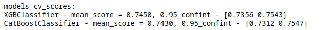

# Прогнозирование оттока клиентов телеком-оператора

В качестве финального проекта [специализации](https://www.coursera.org/specializations/machine-learning-data-analysis) 
я принял участие в [конкурсе на Kaggle](https://www.kaggle.com/c/telecom-clients-prediction2), 
задачей которого является создание модели прогнозирования оттока пользователей по данным, предоставленным крупным 
телеком-оператором Orange. Исходные данные были взяты из 
[соревнования KDD CUP 2009](https://www.kdd.org/kdd-cup/view/kdd-cup-2009/Data) 
и представляли собой наборы, состоящие из 230 анонимизированных признаков (190 числовых и 40 категориальных), 
большинство из которых более чем на половину состояли из пропущенных значений. 

Задача проекта - разработать модель, позволяющую выделить клиентов, склонных к оттоку, для последующего проведения
кампании по их удержанию. Используемая метрика качества - ROC-AUC. При разработке алгоритма учитывалась стратегия 
удержания клиентов, которая заключается в рассылке смс-писем на личный номер абонента с предложением о предоставлении 
20%-ой годовой скидки на услуги связи.

```python
import os
import sys
import warnings; warnings.filterwarnings(action='ignore')

import numpy as np
import pandas as pd

import matplotlib.pyplot as plt
import scikitplot as skplt
%matplotlib inline

from sklearn.metrics import (roc_curve, confusion_matrix, classification_report)

# добавляем в sys.path директорию со скриптами
src_dir = os.path.join(os.getcwd(), '..', 'ocp')
sys.path.append(src_dir)

# загружаем необходимые скрипты
from data.loading import load_data, load_obj
from data.splitting import train_holdout_split

%load_ext autoreload
%autoreload

SEED = 26
```


```python
train, test, numerical, categorical = load_data('../data/processed')
```


```python
(_, _, _, 
 _, _, y_holdout,
 _) = train_holdout_split(train, random_state=SEED)
```


```python
models = load_obj('../data/models_dictionary/models_final.pkl')
```

# Очистка данных
Сначала я отбросил константные признаки, а также те признаки, которые полностью состоят из пропусков (23 признака). 
Затем провел анализ содержания пропусков в строках данных и обнаружил паттерны в их появлении, на основе 
чего удалось сократить признаковое пространство практически в три раза (с 207 признаков до 77). Среди оставшихся 
признаков на основе статистического анализа были выявлены идентичные друг другу категориальные признаки, а также 
функционально зависимые числовые признаки (5 признаков). Финальным этапом отбора значимых для моделирования признаков 
стал отбор, основанный на их важности, выдаваемой моделью градиентного бустинга из библиотеки CatBoost. 
После всех этапов отбора удалось сократить признаковое пространство с 230 до 68 признаков (40 числовых и 
28 категориальных).  

Весь код этапа подробно представлен в [данном ноутбуке](../notebooks/2-ocp-feature-selection.ipynb).

# EDA

Проведенный разведочный анализ данных подробно описан в [данном ноутбуке](../notebooks/3-ocp-eda.ipynb).

# Создание новых признаков

На основе EDA было решено добавить следующие признаки: 
1. Число пропусков в строке;
2. Признаки-индикаторы наличия пропусков;
3. Признаки вида X1 - X2, либо (X1 + 1) / (X2 + 1), для некоторых пар признаков;

Весь код этапа подробно представлен в [данном ноутбуке](../notebooks/4-ocp-feature-generation.ipynb).

# Выбор baseline-модели

Ранее в EDA было установлено, что внутри данных существует два пользовательских сегмента. Последующие разделения 
данных проводились с учетом данного факта. Перед построением baseline-моделей была отложена часть выборки
 для финальной оценки качества итоговых моделей.

Этапы построения baseline-моделей:
1. Задание корректной стратегии кросс-валидации;
2. Создание общего пайплайна предобработки для всех моделей;
3. Задание списка baseline-моделей;
4. Получение cv-оценок для каждой модели из списка, получение статистик по cv-оценкам;

В результате проверки были выбраны две базовые модели для дальнейшей настройки, 
дающие наибольшее качество на кросс-валидации - XGBClassifier и CatBoostClassifier.

Весь код этапа подробно представлен в [данном ноутбуке](../notebooks/5-ocp-baseline-selection).

Полученные результаты представлены ниже.


Словарь models с пайплайнами и cv-оценками выбранных моделей был сохранен с помощью 
модуля pickle в директорию data/models_dictionary для удобства дальнейшей работы.

# Подбор гиперпараметров

Подбор гиперпараметров для выбранных моделей подробно описан в [данном ноутбуке](../notebooks/6-ocp-hyperparameter-optimization.ipynb).

# Оценка качества итоговых моделей

После настройки гиперпараметров моделей были получены следующие cv-оценки:



Далее была произведена оценка качества полученных моделей на отложенной выборке:


Итоговые модели были объединены в ансамбль по следующей схеме: 

предсказания ансамбля = alpha * предсказания xgboost + (1 - alpha) * предсказания catboost

Коэффициент alpha был выбран по максимальной оценке качества на отложенной выборке для alpha в диапазоне от 0 до 1.

Далее полученные оценки вероятностей для двух итоговых моделей и их ансамбля
 были залиты на страницу проводимого конкурса на Kaggle. Результирующие оценки приведены на скриншоте ниже:


По итогу конкурса финальная модель с наилучшим качество (ансамбль двух градиентных бустингов) позволила занять 3 место 
на публичном лидерборде.

# Подбор порога классификации с учетом экономических потерь

Построим ROC, Precision-Recall, Cumulative Gain, Lift кривые и по ним оценим эффективность построенной модели.


```python
alpha = models['stacking']['alpha']
stacking_probs = models['stacking']['holdout_probs']
```


```python
fig, axes = plt.subplots(nrows=2, ncols=2, figsize=(12, 12))

skplt.metrics.plot_roc_curve(y_holdout, 
                             stacking_probs, 
                             ax=axes[0][0]);

skplt.metrics.plot_precision_recall_curve(y_holdout, 
                                          stacking_probs, 
                                          ax=axes[0][1]);

skplt.metrics.plot_cumulative_gain(y_holdout, 
                                   stacking_probs, 
                                   ax=axes[1][0]);

skplt.metrics.plot_lift_curve(y_holdout, 
                              stacking_probs, 
                              ax=axes[1][1]);
```


    

    


Низкие значения ROC-AUC и PR-AUC для объектов класса оттока говорят о том, что модель не позволяет очень качественно 
выделить данный класс из общего числа пользователей. Однако, опираясь на Cumulative Gain Curve и Lift Curve, можно 
уверенно сказать, что построенная модель выделяет класс оттока намного лучше, чем при случайном выборе.

Посмотрим на качество классификации с порогом по умолчанию, равным 0.5.


```python
# превращаем вероятности в предсказания меток классов
vmap = np.vectorize(lambda x: 1 if x else -1)
stacking_preds = vmap(stacking_probs[:, 1].flatten() > 0.5)
```


```python
skplt.metrics.plot_confusion_matrix(y_holdout, 
                                    stacking_preds, 
                                    title=f'Confusion matrix for stacking with alpha = {alpha}');
```


    

    


```python
# посмотрим также на отчет по классификации
print(f'Classification report for stacking with alpha = {alpha}:' + '\n')
print(classification_report(y_holdout, stacking_preds, digits=3), '\n')
```

    Classification report for stacking with alpha = 0.6:
    
                  precision    recall  f1-score   support
    
              -1      0.926     1.000     0.961     12218
               1      0.583     0.007     0.014       982
    
        accuracy                          0.926     13200
       macro avg      0.755     0.503     0.488     13200
    weighted avg      0.901     0.926     0.891     13200
     
    


Из анализа матрицы ошибок и классификационного отчета следует, что модель при пороге равном 0.5 правильно идентифицирует
 только 0.7% от всех пользователей, принадлежащих к классу оттока. Попробуем подобрать более низкий порог с учетом 
 экономических затрат и потерь.

Оценим годовые убытки от проведенной кампании по удержанию клиентов в зависимости от выбираемого порога классификации. 
Т.к. я не обладаю информацией о необходимых для моделирования экономических показателях компании Orange, которая 
предоставила оригинальные данные, то для расчетов я воспользовался данными об экономических показателях 
российского телеком-оператора Beeline, взятыми из 
[этого источника](https://www.comnews.ru/content/208488/2020-08-07/2020-w32/bilayn-pokazal-vysokuyu-zavisimost-tradicionnoy-biznes-modeli). 

Условия проведения кампании по удержанию также являются вымышленными. 
В реальной практике такое оценивание потребует консультации со специалистами компании-заказчика, для которой 
данная модель будет разрабатываться.

Теперь представим, что проводится следующая кампания по удержанию клиентов. Клиентам, отнесенным моделью к классу оттока, 
мы предлагаем 20% скидку на услуги связи в течение года. Об этом мы уведомляем их путем смс-рассылки 
(будем считать, что стоимость одного смс-сообщения равна 1 рублю). Средний месячный доход с одного клиента для нашей 
модельной задачи равен 332 рублям. Будем считать, что процент удержания клиентов равен 70%, а также что 
клиенты, которые ошибочно были отнесены к классу оттока, в 100% случаев будут соглашаться на предлагаемые им условия.


```python
# получим сетку порогов с помощью roc_curve
_, _, thrs = roc_curve(y_holdout, stacking_probs[:, 1].flatten())

# для каждого из порогов будем считать количество TP, FP и FN
tp_grid, fp_grid, fn_grid = (np.zeros(thrs.shape), 
                             np.zeros(thrs.shape), 
                             np.zeros(thrs.shape))

for i, thr in enumerate(thrs):
    # конвертируем вероятности в оценки классов по порогу
    preds_by_thr = vmap(stacking_probs[:, 1].flatten() > thr)
    
    # c помощью матрицы ошибок получаем TP, FP и FN
    _, fp, fn, tp = confusion_matrix(y_holdout, preds_by_thr).ravel()

    # записываем их
    tp_grid[i] = tp
    fp_grid[i] = fp
    fn_grid[i] = fn
```


```python
# далее для каждого из порогов проведем
# расчет суммарных потерь

# средний годовой доход с одного клиента
ayrpu = 332*12

# стоимость удержания одного клиента
discount = 0.2
churn_cost = ayrpu * discount + 1

# процент удержания после взаимодействия
prob_return = 0.7

# считаем потери
losses = (
    # правильно распознаны, принимают предложение
    tp_grid * prob_return * (-churn_cost)  
    # правильно распознаны, не принимают предложение
    + tp_grid * (1-prob_return) * (-ayrpu) 
    # не распознаны моделью вовсе
    + fn_grid * (-ayrpu)
    # неправильно распознаны, принимают предложение                 
    + fp_grid * (-churn_cost)           
)           
```


```python
# выберем порог классификации, при котором
# достигаются минимальные потери
thrs_best = thrs[losses == max(losses)][0]
    
# отрисуем полученные данные
fig = plt.figure(figsize=(16, 10))
plt.plot(thrs, losses, color='b', lw=2)
plt.scatter([thrs_best], [max(losses)], color='r', s=50, label='Threshold = {:.4f}'.format(thrs_best))
plt.xlim([0, 1])
plt.xticks(ticks=np.arange(0, 1.01, 0.02), rotation=90)
plt.xlabel('Threshold')
plt.ylabel('Loss of Profitability')
plt.legend(loc="lower right")
plt.grid()
plt.show()
```


    

    


```python
# превращаем вероятности в предсказания меток классов по выбранному порогу
stacking_preds_23 = vmap(stacking_probs[:, 1].flatten() > thrs_best)

skplt.metrics.plot_confusion_matrix(y_holdout, 
                                    stacking_preds_23, 
                                    title=f'Confusion matrix for stacking with thr = {thrs_best:.4f}');
```


    

    


```python
# посмотрим также на отчет по классификации
print(f'Classification report for stacking stacking with thr = {thrs_best:.4f}:' + '\n')
print(classification_report(y_holdout, stacking_preds_23, digits=3), '\n')
```

    Classification report for stacking stacking with thr = 0.2271:
    
                  precision    recall  f1-score   support
    
              -1      0.933     0.983     0.957     12218
               1      0.366     0.120     0.181       982
    
        accuracy                          0.919     13200
       macro avg      0.650     0.552     0.569     13200
    weighted avg      0.891     0.919     0.900     13200
     
    


Классификация по оптимальному, с точки зрения экономических потерь, порогу позволяет выявить 12% клиентов класса оттока. 
С учетом коэффициента удержания, равного 0.7, итоговая модель при внедрении позволит уменьшить годовой отток клиентов в 
среднем на 8.4%.
